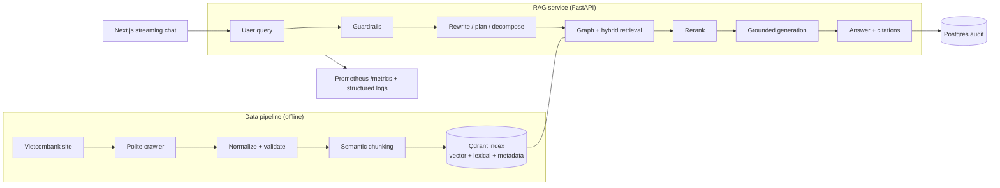

# Vietcombank RAG Platform

[](https://banking-rag-chatbot-gray.vercel.app/)
[](https://github.com/lamhoangphuc2003st/banking-rag-chatbot/actions/workflows/ci.yml)
[](LICENSE)
[](pyproject.toml)

A portfolio-grade Retrieval-Augmented Generation platform that answers questions about
**public Vietcombank products** (loans, cards, savings, transfers, insurance, FAQ) in
Vietnamese — every answer grounded in crawled sources with citations, protected by input
guardrails, and measured by an evaluation suite.

> ⚠️ Unofficial project for public information only. Not affiliated with Vietcombank.
> It performs no transactions and never handles balances, credentials, or personal accounts.

## Demo

- **Live demo:** **https://banking-rag-chatbot-gray.vercel.app/**
- Ask in Vietnamese about public Vietcombank products (e.g. *"Chi tiết sản phẩm Tiết kiệm tích lũy"*)
  and watch the answer stream in token by token with source citations.
- The backend runs on a Render free instance kept warm by a scheduled ping. If it has been idle,
  the **first** request may take ~30–60s to cold-start; subsequent replies are fast.

<!-- Optional: record a 10–15s clip (query → streamed answer → citations), save it to
     docs/assets/demo.gif, and embed it here. -->

## Scope

- Public information only: loans, credit cards, fees, requirements, FAQ, and support pages.
- No banking transactions, account lookup, balance lookup, credential handling, or personalized financial advice.
- Every answer should be grounded in retrieved sources and include citations.

## Architecture



The online pipeline is hand-built async orchestration (no LangGraph) so every stage —
guardrails, query rewrite/planning/decomposition, graph + hybrid retrieval, reranking,
grounded generation — is explicit and independently testable. The non-streaming `answer()`
and streaming `stream_events()` share one implementation, so they can never diverge.

## Tech Stack

- API: Python 3.11+, FastAPI, Pydantic v2, SQLAlchemy, Alembic.
- RAG: custom async orchestration (guardrails → rewrite/plan/decompose → graph + hybrid retrieval → rerank → grounded generation), Qdrant, Redis, PostgreSQL, configurable LLM/embedding/reranker providers via LiteLLM.
- Data: httpx + BeautifulSoup crawler, Pydantic validation, reproducible chunk/index commands.
- LLMOps: offline evaluation (retrieval + guardrails), Prometheus metrics, structured logging.
- Infra: Docker Compose, production Dockerfile, Kubernetes manifests, GitHub Actions CI.
- Web: Next.js, TypeScript, streaming (SSE) chat UI with citations and clarifications.

## Quick Start

```bash
cp .env.example .env
py -3.11 -m venv .venv
.venv\Scripts\activate
python -m pip install -e ".[dev]"
docker compose up -d postgres qdrant
make api
```

Before starting the API, set `REDIS_URL` in `.env` to your managed Redis
connection string. Local and production should use the same Redis server; this
repo does not create a Redis container in Docker Compose.

Run the web app:

```bash
cd apps/web
npm install
npm run dev
```

The web app calls `/api/backend/*` by default. Next.js rewrites that path to
`BACKEND_API_URL`, defaulting to `http://localhost:8000`, so local development
does not require exposing a public API URL in the browser bundle.

## Data Pipeline

```bash
make crawl
make crawl-catalogs
make normalize
make normalize-catalogs
make chunk
make chunk-catalogs
make merge-chunks
make index
```

Each pipeline stage writes versioned artifacts under `data/` and records source URL, content hash, crawl time, product type, section, and language.

The API also reads GraphRAG catalog/detail artifacts from `data/` at runtime. In containers, mount the generated data directory to `/app/data` and set `RAG_DATA_ROOT=/app/data`; the Docker image intentionally does not embed raw/normalized/chunk artifacts.

Use `make index` for non-destructive upserts into the configured Qdrant collection. Use `python -m packages.data_pipeline.cli index --recreate` only when you intentionally want to drop and rebuild the collection.

## Redis

Redis is an external managed service for this project. Create one Redis instance
with a provider such as Upstash, Redis Cloud, AWS ElastiCache, Azure Cache for
Redis, or another managed Redis provider. Copy its connection string into:

- Local: `.env` as `REDIS_URL=...`
- Production: the `REDIS_URL` value in your secret manager or Kubernetes Secret

The API uses that same Redis endpoint for RAG cache and rate limiting. Nothing
in this repo starts or owns the Redis server.

If Redis is in another region or a free managed tier, increase the socket
timeouts instead of disabling Redis cache:

```bash
REDIS_SOCKET_CONNECT_TIMEOUT_SECONDS=2
REDIS_SOCKET_TIMEOUT_SECONDS=5
```

## Deploy: Render + Vercel

Backend deploys as a Render Python web service from `render.yaml`. Frontend
deploys as a Vercel Next.js app with root directory `apps/web`.

Before deploying, commit the runtime data artifacts that are intentionally
unignored:

- `data/chunks/vietcombank_chunks.jsonl`
- `data/chunks/vietcombank_products_chunks.jsonl`
- `data/chunks/vietcombank_faq_chunks.jsonl`
- `data/chunks/vietcombank_product_catalogs_chunks.jsonl`
- `data/normalized/vietcombank_product_catalogs_normalized.jsonl`

Backend Render environment variables:

- `DATABASE_URL`
- `REDIS_URL`
- `QDRANT_URL`
- `QDRANT_API_KEY`
- `OPENAI_API_KEY`
- `COHERE_API_KEY`
- `API_CORS_ORIGINS=https://your-vercel-app.vercel.app`

The Render pre-deploy command runs Alembic migrations and
`python -m packages.data_pipeline.cli verify-runtime --check-external`. Make
sure the Qdrant collection has already been indexed with `make index`; the
pre-deploy check fails if the collection is missing or empty.

Frontend Vercel environment variables:

- `BACKEND_API_URL=https://your-render-service.onrender.com`

Do not set `NEXT_PUBLIC_API_BASE_URL` in production unless you intentionally
want the browser to call Render directly. The default Vercel rewrite avoids
baking the backend URL into client code.

## Cohere Rerank

To enable Cohere reranking, set:

```bash
RERANKER_PROVIDER=cohere
RERANKER_MODEL=rerank-v4.0-fast
COHERE_API_KEY=...
```

If the Cohere key is missing or the provider call fails, the API falls back to
the local retrieval-score ordering so chat responses still complete.

## Evaluation

The whole suite runs **offline and reproducibly** — no Qdrant, embedding provider or
LLM required — so anyone can regenerate the numbers from a clean checkout:

```bash
make eval-report      # retrieval + guardrails -> data/reports/*.json + docs/evaluation-results.md
make eval             # retrieval only (offline lexical baseline over the committed corpus)
make eval-guardrails  # guardrails only (credential/PII blocking + scope)
make eval-live        # retrieval against the live Qdrant hybrid stack (needs Qdrant)
make eval-live-deploy BASE_URL=https://<service>.onrender.com  # evaluate the deployed API end to end
pytest                # unit + API tests, incl. eval-harness + golden-integrity checks
```

Once deployed, `packages/evals/live_eval.py` evaluates the running service end to
end — health/readiness, real `/v1/chat` answer & citation relevance, guardrails,
latency and `/metrics`. See
[docs/evaluation-results-live.md](docs/evaluation-results-live.md) for the latest
live run (which surfaced a graceful-degradation bug the offline suite could not).

Retrieval (`packages/evals/retrieval_eval.py`) reports document-level Recall@k, MRR and
nDCG@k across difficulty bands, ranking the committed corpus with the *deployed* lexical
scorer. The golden set (`packages/evals/build_golden.py`) derives every label from the
corpus so labels can never go stale. Guardrails (`packages/evals/refusal_eval.py`) are
deterministic and run in CI. See [docs/evaluation.md](docs/evaluation.md) for methodology
and honest limitations, [docs/evaluation-results.md](docs/evaluation-results.md) for the
full generated results, and [docs/qualitative-review.md](docs/qualitative-review.md) for a
manual 100-question answer-quality review.

## Results

Generated by `make eval-report`; reproducible from a clean checkout.

**Retrieval** — offline lexical baseline over 623 indexed chunks, 97 labelled queries
across difficulty bands (document-level relevance):

| Slice | Recall@1 | Recall@10 | MRR | nDCG@10 |
| --- | --- | --- | --- | --- |
| Overall | 0.81 | 0.93 | 0.87 | 0.89 |
| verbatim / no-accent | 0.95 | 1.00 | 0.98 | 0.99 |
| keyword | 0.73 | 0.93 | 0.82 | 0.85 |
| **paraphrase (hard)** | **0.45** | **0.70** | **0.56** | **0.59** |

The `paraphrase` band — colloquial rewrites with a real vocabulary gap — is the stress
test and is exactly what the production dense-embedding + reranker stack exists to close.
No-accent queries match verbatim (the retriever folds diacritics), and 6/6 out-of-scope
queries retrieve zero context, so generation can't be grounded on noise.

**Guardrails** — 36 labelled prompts (safe / sensitive-keyword / secret / PII /
out-of-scope), offline and deterministic:

| Check | Accuracy | Precision | Recall |
| --- | --- | --- | --- |
| Credential / PII blocking | 1.00 | 1.00 | 1.00 |
| Out-of-scope detection | 0.92 | 0.90 | 1.00 |

No secret or PII prompt is ever allowed through (false-negative rate 0), and no public
question that merely mentions a sensitive keyword (OTP, PIN, CVV, card number) is
over-blocked (false-positive rate 0). The scope misses are short-keyword substring
collisions, tracked as future work.

## Observability

- `GET /metrics` — Prometheus metrics: request volume and latency (`rag_chat_latency_seconds`),
  retrieved/reranked context depth, refusals by reason, and retrieval cache hit/miss. Scrape
  config in [`infra/prometheus`](infra/prometheus).
- `GET /health/live` and `GET /health/ready` (readiness checks Qdrant, Postgres, Redis and the
  product graph).
- Structured JSON logs (structlog) to stdout; every answer carries a `trace_id`.

## Repository Layout

```text
apps/api/                  FastAPI RAG service
apps/web/                  Next.js chat UI
packages/data_pipeline/    crawler, normalizer, chunker, indexer
packages/evals/            retrieval, guardrail, and answer-quality evaluation
packages/shared/           shared schemas and utilities
infra/                     Kubernetes, monitoring, deployment assets
docs/                      architecture, data governance, evaluation
tests/                     unit and API tests
```

## License

Released under the [MIT License](LICENSE).
